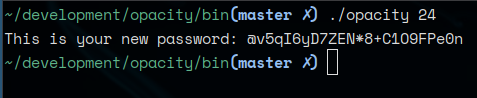

# Opacity (Open Password Utility)
## A command line tool for creating and storing strong and secure passwords

Currently Implemented:
Password generator - Generate a secure password using lowercase, uppercase, special characters, and numbers.
                   - Passwords will ensure a minimum number of each type and be between 8 and 63 characters in length.
Planned to Implement:
Password storage and access via cli with fuzzy searching.

ex: opacity 24 twitch
Will create and output a length 24 password and store it under the name "twitch" for later lookup

ex: opacity -l twitch
Will (l)ist stored passwords matching the account fuzzy search "twitch"

## Usage
$ opacity (optional pass length)
-------------------------
Supplying no arguments will create a password of length 15
Minimum password length is 8, while maximum is 63

